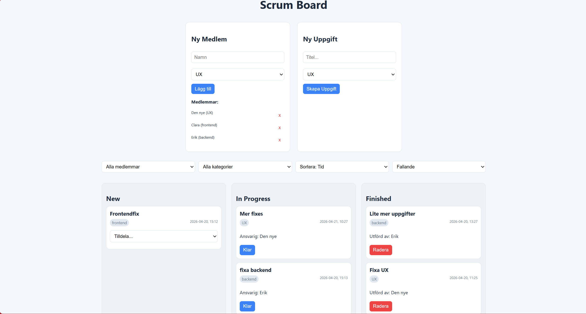
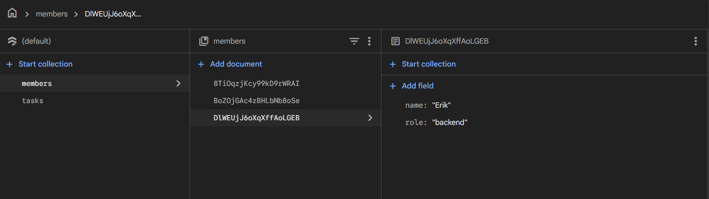
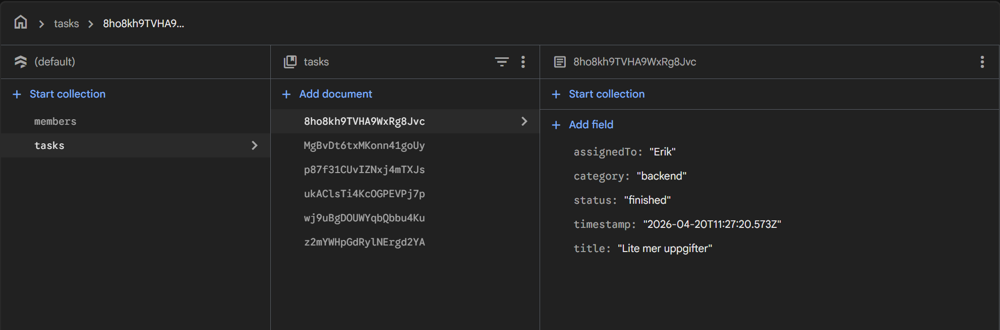

# JAVA24 - Avancerad JavaScript

## Projektbeskrivning
Detta projekt är en Scrum Board byggd i React med Firebase Firestore.

---

##  Screenshots

###  Scrum Board

###  Firebase Database

---

## Funktionalitet
- Skapa team members (UX, frontend, backend)
- Skapa uppgifter
- Tilldela uppgifter
- Status: new → in progress → finished
- Radera färdiga uppgifter
- Filtrera och sortera

---

## Teknisk stack
- React
- Firebase Firestore
- Vite
- JavaScript
- CSS

---

## Starta projektet
Installera dependencies:

npm install  

Starta projektet:

npm run dev

Bygg projektet:

---

## Firebase
Konfiguration finns i src/firebase.js

